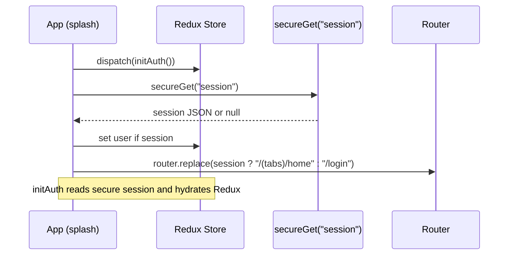
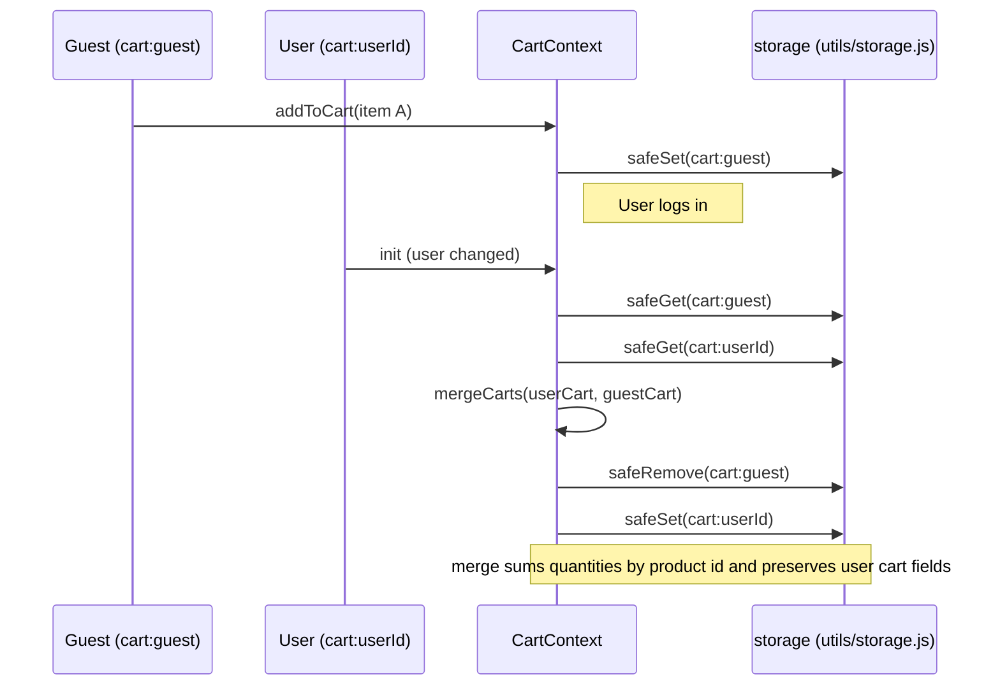
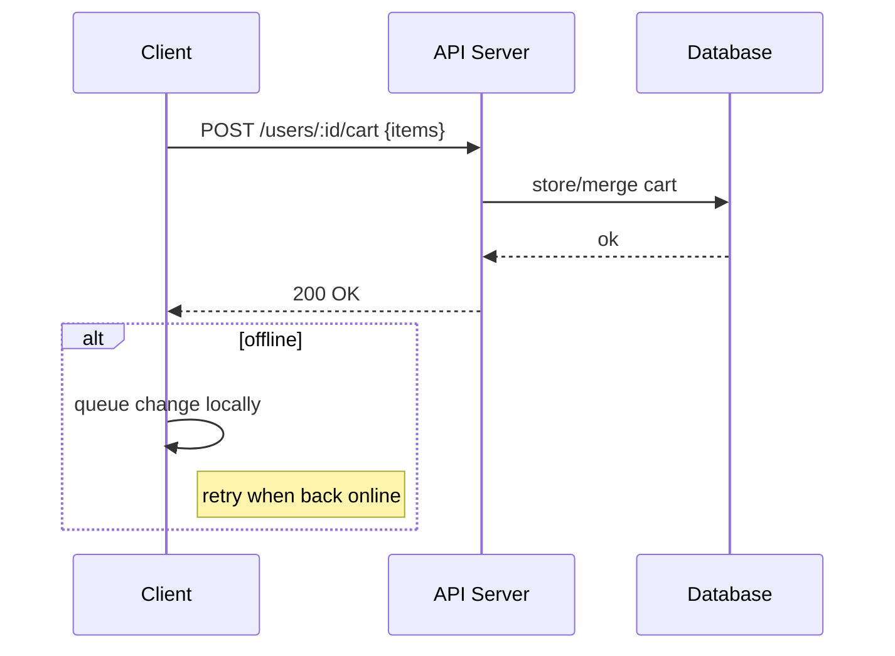

# ECommerceApp — Architecture Diagrams

This file contains simple architecture diagrams for the ECommerceApp (Mermaid format) and short explanations. You can view the diagrams in editors that support Mermaid (VS Code with the "Markdown Preview Mermaid Support" extension or GitHub's Mermaid rendering).

---

## 1) High-level architecture (flowchart)

```mermaid
flowchart TD
  U[User (Mobile App)] --> UI[UI Screens (Expo Router)]
  UI -->|Auth screens| Auth[Redux: Auth Slice]
  UI -->|Product / Cart / Wishlist| Contexts[React Contexts]
  Contexts --> Storage[Local Storage]
  Auth --> Secure[Secure Storage (SecureStore) / AsyncStorage fallback]
  Secure --> Storage
  Storage -->|Optional sync| Server[Backend / API]
  Server --> DB[(Database)]

  subgraph Client
    UI
    Auth
    Contexts
    Secure
    Storage
  end

  style Server fill:#f9f,stroke:#333,stroke-width:1px
  style DB fill:#fff0b3,stroke:#333,stroke-width:1px
```

Notes:

- `Auth` lives in Redux (`src/store/authSlice.js`).
- `CartContext` and `WishlistContext` manage cart/wishlist in Context and persist to per-user keys in AsyncStorage (or server when sync is implemented).
- `Secure Storage` is a wrapper that prefers Expo SecureStore and falls back to AsyncStorage.

---

## 2) App startup & Auth sequence (sequence diagram)



Explanation:

- On startup, `splash.jsx` calls `initAuth()` and uses `getUserSession()` (which uses the secure wrapper) to decide initial navigation.
- The secure wrapper uses Expo SecureStore when installed; otherwise AsyncStorage is used as a fallback.

---

## 3) Cart guest -> login merge (sequence diagram)



Explanation:

- The `CartContext` loads both guest and user carts on user change and merges guest data into the user's cart; then it removes the guest key.
- Saves are debounced to avoid frequent AsyncStorage writes.

---

## 4) Recommended server-sync sequence (example)



Notes:

- Client should perform optimistic local updates and enqueue server syncs when offline.
- Conflict resolution: prefer merge-by-id (sum quantities) or last-write-wins depending on product semantics.

---

## 5) Keys & important helpers

- `session` — secure session JSON (via `utils/secureStorage.js`).
- `cart:<userId|email>` or `cart:guest` — per-user cart storage (helpers in `utils/storage.js`).
- `wishlist:<userId|email>` or `wishlist:guest` — per-user wishlist storage.
- `utils/storage.js` provides `cartKeyFor(user)`, `wishlistKeyFor(user)`, `safeGet`, `safeSet`, `safeRemove`.
- `utils/secureStorage.js` provides `secureGet`, `secureSet`, `secureRemove` (uses SecureStore when available).

---

## 6) How to view these diagrams

- In VS Code: install a Mermaid preview extension (e.g., "Markdown Preview Mermaid Support").
- On GitHub: GitHub supports Mermaid rendering in `.md` files in many cases — if not, paste the Mermaid code into the online Mermaid Live Editor.

---

## 7) Next implementation options (pick one)

1. Install `expo-secure-store` to enable encrypted session storage.
2. Scaffold a `utils/syncClient.js` and wire `CartContext` to call a `syncCart` function for server sync (safe no-op until endpoints are configured).
3. Migrate cart & wishlist into Redux (adapter pattern or full migration). I recommend adapter first.

If you'd like, I can implement any of the above. Tell me which and I will proceed and run lint/type checks.
